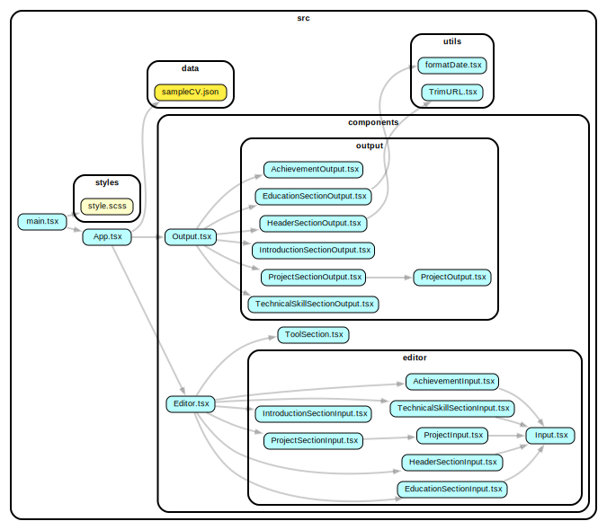

# CV Application

-   Live: [CV Application Live](https://idyllic-rabanadas-946c89.netlify.app/)

## Description

Create and customize your CV effortlessly with this React-based CV Application. Generate a side-by-side CV with your details and select from three different fonts. You can even download the generated CV as a PDF with text selection and active hyperlinks.

## Features

-   **Input Details**: Input your personal and professional details.
-   **Font Selection**: Choose from three different fonts to style your CV.
-   **CV Generation**: Instantly generate a side-by-side CV layout.
-   **PDF Download**: Download the CV as a PDF with text selection and active hyperlinks.

**Note**: When clicked Download PDF select `Save to PDF` from drop down of destination section to make CV text selectable and active hyperlinks

## Fonts

Choose from three available fonts:

-   **Classic Serif (serif)**: Georgia, "Times New Roman", Times, serif
-   **Modern Sans-Serif (sans-serif 1)**: Calibri, Arial, sans-serif
-   **Standard Sans-Serif (sans-serif 2)**: Arial, Helvetica, sans-serif

## Usage

1. Access the [CV Application Live](https://idyllic-rabanadas-946c89.netlify.app/).
2. Input your details and select your preferred font.
3. Generate the CV layout.
4. Download your CV as a PDF using the print option. Make sure to select "Save as PDF" in the print dialog for selectable text and valid hyperlinks.

## Dependency Graph



## Installation

1. Clone the repository:
    ```bash
    git clone https://github.com/karprabha/cv-application
    ```
2. Navigate to the project directory:
    ```bash
    cd cv-application
    ```
3. Install dependencies:
    ```bash
    npm install
    ```
4. Start the development server:
    ```bash
    npm start
    ```

## Technologies Used

-   "React"
-   "TypeScript"
-   "SCSS"
-   "Vite"

## Future Plans

I have plans on implementing following features in future

1.  Font size option
2.  More font style options
3.  Different CV styles (including double column CV)

## Contributing

Contributions are welcome! If you'd like to contribute to the project, please follow these steps:

-   Fork the repository.
-   Create a new branch for your feature or bug fix.
-   Make your changes and commit them with descriptive commit messages.
-   Push your changes to your forked repository.
-   Create a pull request to the original repository's 'main' branch.
